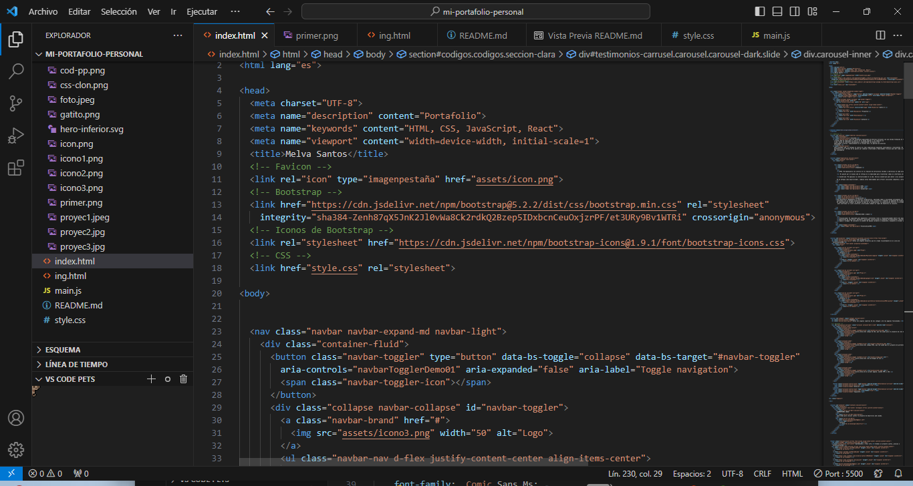
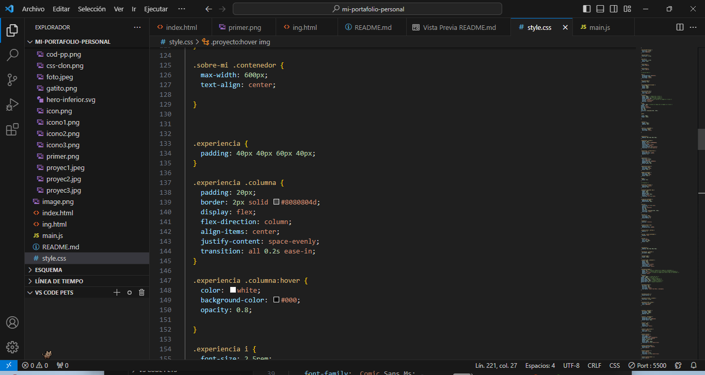
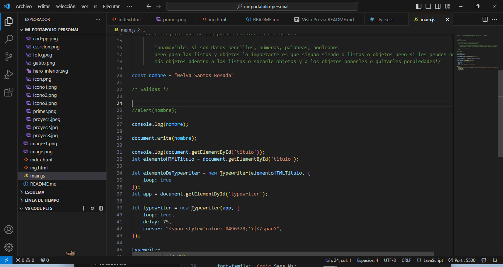

# Portafolio: Tecnolochicas PRO

## Índice

- [Introducción](#introducción)
- [Demo](#demo)
- [Lo que Construiremos](#lo-que-construiremos)
- [Propósito](#propósito)
- [Objetivos de Aprendizaje](#objetivos-de-aprendizaje)
- [Requisitos para Desarrollar](#requisitos-para-desarrollar)
- [Lenguajes Usados](#lenguajes-usados)
- [Autoría e Inspiración](#autoría-e-inspiración)

### Introducción

Este proyecto fue creado durante el bootcamp de Tecnolochicas PRO como una página web responsiva, adaptable a diversos dispositivos. Tiene como propósito poner en práctica el uso de frameworks y el conocimiento del desarrollo web. El enfoque principal es mostrar la experiencia de la desarrolladora a través de un formato de portafolio, incluyendo su perfil, proyectos, voluntariados y medios de contacto.
****
### Demo

Puedes ver una demostración del proyecto [aquí](https://github.com/MelvaBosada/mi-portafolio-technolochicasPRO-yucatan).
****
### Lo que Construiremos

Construiremos una página web responsiva que sirva como portafolio personal para mostrar la experiencia, proyectos, voluntariados y medios de contacto de la desarrolladora.
****
### Propósito

Este proyecto fue creado durante el bootcamp de Tecnolochicas PRO, es una pagina web resposiva(adaptable a diversos dispositivos) con el proposito de poner en practica el uso de frameworks y el conocimiento del desarollo web.
****
Enfoncandose en mostrar la experencia  de la desarrallora del proyecto, en formato de portafolio con mencion de su perfil, sus proyectos, voluntariados y medios de contacto.

Incluye recursos multimedia para interactuar con ellos.
****
### Objetivos de Aprendizaje

Los objetivos de aprendizaje incluyen la implementación de diseño responsivo, uso de frameworks, estructuración de un portafolio digital y práctica en el desarrollo web.
****
### Requisitos para Desarrollar

Se necesitarán conocimientos básicos de HTML, CSS y posiblemente JavaScript, además de acceso a un editor de texto y un navegador web.
****
### Lenguajes Usados

- HTML5
- CSS3
- JavaScript
****
### Autoría e Inspiración
Puedes conocer más sobre mi trabajo en [mi perfil en GitHub](https://github.com/MelvaBosada) o [mi perfil de linkedin personal](https://www.linkedin.com/in/melva-santos-2963b52a3/).
Contacto: msantosbosada14@gmail.com
Autoría: Melva Santos Bosada
© 2023 Melva Santos | Miau Miau | (Programa Technolochicas PRO)
Este proyecto fue inspirado en el trabajo de Jane Doe en el campo del desarrollo web. Su enfoque fue fundamental para el desarrollo de esta página web.
